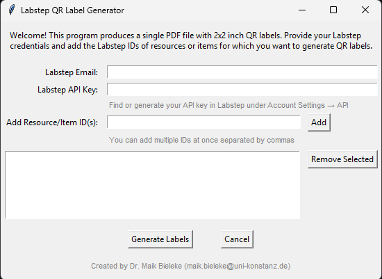

# labstep-id2label
id2label is a python-based  program that generates QR labels based for Labstep resources and items.

  

## Test Instructions

Run the python script from terminal:

`python id2label.py`

## Build Instructions

Run the bat file from terminal:

`./build_exe.bat`
